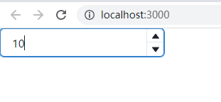
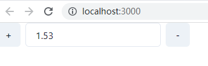

# Headerless组件的学习与实践

概念：无头组件即无UI组件，主要是将UI与逻辑进行分离，对逻辑进行封装而把UI的实现交给业务的这样一种设计方式。这样的好处是业务有更大的UI设计的空间，框架只需要考虑逻辑满足更多需求达到高复用的情况
目前使用了headerless理念的框架主要有[chark](https://chakra-ui.com/)、[tankStack](https://tanstack.com/)等

这几天也是看了一些chark的设计以及代码，对headless组件有了初步的了解

我们首先来看一下chark的使用方式(以Number Input组件为例)：

```javascript
// 常规使用方式
<NumberInput maxW={16} defaultValue={15} min={10} step={1}>
  <NumberInputField />
  <NumberInputStepper>
    <NumberIncrementStepper />
    <NumberDecrementStepper />
  </NumberInputStepper>
</NumberInput>
```



这五个组件都是由框架导出，以下分别是各自的作用

- **NumberInput**: The wrapper that provides context and logic to the components.
- **NumberInputField**: The input field itself.
- **NumberInputStepper**: The wrapper for the input's stepper buttons.
- **NumberIncrementStepper**: The button to increment the value of the input.
- **NumberDecrementStepper**: The button to decrement the value of the input.

这种使用方式自带了UI，对于不需要太多个性化UI的业务场景提供使用，能大大减少UI开发的工作量。但是对于需要定制化UI的业务场景来说显然不够友好，因此chark还提供了另一种使用方式，能够大大提高UI自由度。

```javascript
function HookUsage() {
  const { getInputProps, getIncrementButtonProps, getDecrementButtonProps } =
    useNumberInput({
      step: 1,
      defaultValue: 1.53,
      min: 1,
      max: 6,
      precision: 2,
    })

  const inc = getIncrementButtonProps()
  const dec = getDecrementButtonProps()
  const input = getInputProps()

  return (
    <HStack maxW='320px'>
      <Button {...inc}>+</Button>
      <Input {...input} />
      <Button {...dec}>-</Button>
    </HStack>
  )
}
```
呈现结果如下：



在该案例中我们可以看到其中的Buton组件和Input组件都可以进行替换，完全由自己的业务实现相关的UI和布局等。


目前headless组件的实现方式主要有两种方式：hook和reandProps
Hooks 模式的好处是代码可读性强不需要太多回调。但 Hooks 模式在 React 场景下会引发不必要的全局 ReRender，相比之下，RenderProps 只会将重渲染限定在回调函数内部，在性能上 RenderProps 更优。
在了解和学习之后，我也使用hook的方式实现了一个简单的Number Input组件(锻炼一下抽象能力)
```javascript
// hook
import { useState } from "react";
export interface InputNumberProps {
  max?: number;
  min?: number;
  defaultValue?: number;
  value?: number;
  onChange?: (val: number) => void;
  step?: number;
  pattern?: string;
  isDisabled?: string;
}

export function useInputNumber(props: InputNumberProps) {
  const {
    max,
    min,
    defaultValue = 0,
    onChange,
    value,
    step = 0,
    pattern = "[0-9]*(.[0-9]+)?",
    isDisabled = false,
  } = props;

  const [NumberValue, setNumberValue] = useState<number>(value ?? defaultValue);

  const incFn = () => {
    if (isDisabled ) return;

    onChange_(NumberValue + step);
  };

  const decFn = () => {
    if (isDisabled) return;
    onChange_(NumberValue + step);
  };

  const reg = new RegExp(pattern);
  const onChange_ = (val: string | number) => {
    let inputVal = val;

    if (typeof val === "string") {
      if (!reg.test(val)) return;
      inputVal = parseInt(val);
    }
   
    // @ts-ignore
    if (isInRange(inputVal, min, max) && !isDisabled) {
     
      setNumberValue(inputVal as number);
      if (!!onChange) {
        onChange(inputVal as number);
      }
    }
  };

  const isInRange = (
    val: number,
    min: number | undefined,
    max: number | undefined
  ) => {
    if (min === undefined && max === undefined) return true;

    if (min !== undefined && max !== undefined) {
      if (val >= min && val <= max) return true;
      else return false;
    } else if (min === undefined) {
      // @ts-ignore
      if (val <= max) return true;
      else return false;
    } else if (max === undefined) {
      if (val >= min) return true;
      else return false;
    }
  };

  const getInputProps = () => {
    return {
      value: NumberValue,
      onChange: (event: any) => {
        onChange_(event.target.value);
      },
    };
  };

  const getIncProps = () => {
    return {
      isDisabled: isDisabled,
      onPointerDown: () => {
        incFn()
      },
    };
  };

  const getDecProps = () => {
    return {
      isDisabled: isDisabled,
      onPointerDown: decFn,
    };
  };

  return { getInputProps, getIncProps, getDecProps };
}


// component
import React from "react";
import useInputNumber from "./MyNumberInputHook";

function MyInputNumber() {
  const { getInputProps, getIncProps, getDecProps } = useInputNumber({
    defaultValue: 0,
    min: -10,
    max: 100,
    step: 1,
  });

  const incProps = getIncProps();
  const decProps = getDecProps();
  const inputProps = getInputProps();

  return (
    <div>
      <button
        style={{ padding: "10px", backgroundColor: "#eee" }}
        {...incProps}
      >
        +
      </button>
      <input {...inputProps} />
      <button
        style={{ padding: "10px", backgroundColor: "#eee" }}
        {...decProps}
      >
        -
      </button>
    </div>
  );
}

export default MyInputNumber;

```

Headless UI 的优与劣
优势
有极强大的 UI 自定义发挥空间，支持高定制扩展
可以看到 headless 的优势也非常明显，因为它更抽象，所以它拥有非常强大的定制扩展能力：支持标签排版、元素组合，内容插入、样式定义等等都能满足。

最大化代码复用，减小包体积
从上面可以看到，组件的状态逻辑可以尽可能达到最大化复用，帮助我们减小包体积，增强整体可维护性。

对单测编写友好
因为基本都是逻辑，对于事件回调、React 运行管理等都可以快速模拟实现单测编写和回归；而 UI 部分，一般容易变化，且不容易出 bug，可以避免测试。

劣势
对开发者能力要求高，需要较强的组件抽象设计能力
抽象层次越高，编写难度越大。对于这样 headless 组件，我们关注的组件 API 设计和交互逻辑抽离，这非常考验开发者的组件设计能力。

使用成本大，不建议简单业务场景下铺开使用
UI 层完全自定义，存在一定开发成本，因此需要评估好投入产出，对于没有特别高要求的 2b 业务的话，还是建议使用 Ant Design 这样自带 UI 规范的组件库进行开发。


